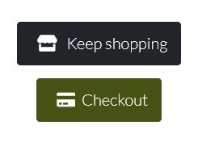
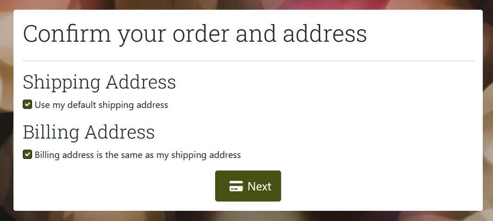
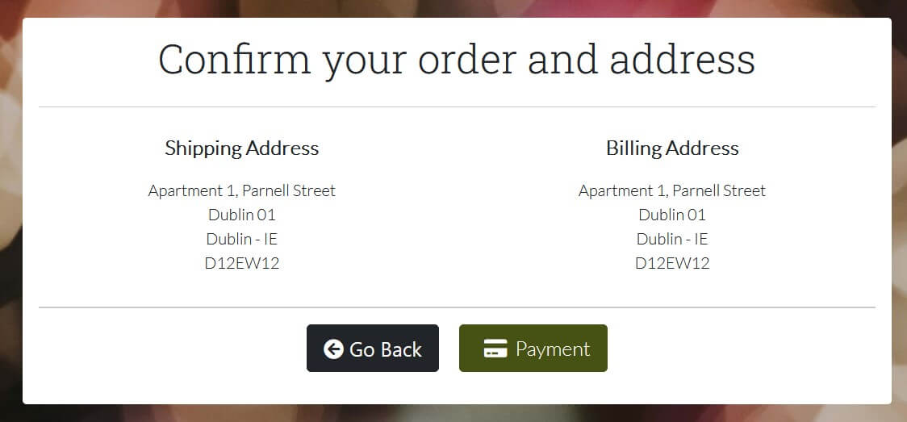

<h1 align=center> </h1>

Live app link [here](https://theregionaltaste.herokuapp.com/)

## User Experience

### User Stories

1. As a user, I would like to be able to …

    1.1 ... register using name, email, username and password;
    
    1.2. ... login on website using my email/username and password;
    
    1.3 ... logout easily;
    
    1.4 ... have all information about website services on landing page;

    1.5 ... see details about each available box;
    
    1.6 ... add boxes on my bag;

    1.7 ... check all available boxes and products;

    1.8 ... pay for my product using a Credit Card;

    1.9 ... add my shipping and billing address;

    1.10 ... get a confirmation email with my order and shipping details;

    1.11 ... create my profile

    1.12 ... check my previous order details on profile page;

    1.13 ... subscribe the newsletter;

    1.14 ... unsubscribe the newsletter;

    1.14 ... select 5 products to add on my box;

    1.15 ... check user's review's on boxes;

    1.16 ... add a review on boxes;
    
    1.17 ... edit or delete my reviews on boxes. 

2. As a site admin, I would like to be able to …

    2.1  ... have admin privileges and check the product management page;

    2.2 ... be present to a list of products to edit or delete;

    2.3 ... create products or add them to the boxes;

    2.4 ... o delete created products or boxes;

    2.5 ... the user to be redirected to a specific page if any error happens.

### 1. Strategy

  + **Project Goal**

Create an e-commerce app that allows people (users) who lives out of their home countries or loves different cuisines to have access to a range of regional products from various part of the world.  

### 2. Scope

 * A simple, straightforward, intuitive UX experience;
 * An explicit content; 
 * An easy navigation for the user through all the features;
 * A site that is visually appealing on most devices.

## Functional Scope 

**Flowchart**

**DER - Diagram Entity Relationship**

**Agile Methodology**

All functionality and development of this project were managed using [Jira](https://bestbeer.atlassian.net)

* Credentials to this management tool will be provided during submission.

All sprints are described here.

Test cases were linked with every User story presented above, and can be found in [TESTING.md](TESTING.md)- Automated testing section. 

* Sprint 1 - 04/01/2022 - 11/01/2022 (Finished at 09/01/2022)

  + Initial setup
    - As a developer, I want to setup django templates
  + Create Database and Deployment on Heroku
    - As a developer, I want to set up a Database to store all data 
    - As a developer, I want to deploy website on Heroku
  + Create user registration and login/logout features
    - As a user I want to register on website
    - As a user I want to login on website
    - As a user I want to logout on website
    - As a site admin I want to have admin privileges 

* Sprint 2 - 09/11/2022 - 16/01/2022 (1 week)

  + Create products page
    - As a shopper I want to to see details about each available box
    - As a shopper I want to add product on my bag 
    - As a shopper I want to check all available products 
    - As a shopper I want to sort a list of products by region (Not done on this sprint. Will be add in future sprints)

* Sprint 3 and 4 - 17/01/2022 - 24/01/2022 (2 weeks)

  + Create order and payment pages
    - As a user I want to pay for my product 
    - As a user I want to add my shipping and billing address
    - As a user, I want to get a confirmation email with my order and shipping details 

* Sprint 5 - 30/01/2022 - 06/02/2022

  + Create Profile
    - As a user, I want to create my profile
    - As a user I want to check my previous order details

* Sprint 6 - 07/02/2022 - 14/02/2022

  + Add products on Box
    - As a user, I want to select 5 products to add on my box

  + Product Management
    - As a site admin, I want to create products or add it to the box
    - As a site admin, I want to delete created products
    - As a site admin, I want to be present to a list of products to edit or delete

* Sprint 7 - 13/02/2022 - 20/02/2022

  + User acceptance
    - As a user I want to use all features on platform without major issues

  + Validation
    - As a site owner I want to make sure that all files are validateds

### 3. Structure

* A clear and straightforward layout is in place to ensure users can navigate intuitively and have a leisurely experience.
* Navbar is fixed on top to facilitate users to navigate through pages easily. Small navigation is the same on all pages to ensure easy navigation.
* Footer is fixed on the bottom with links to social media and newsletter subscription.

### 4. Skeleton

Wireframes created with Balsamiq. The project was developed from initial wireframes, and some modifications were made during the development process in respose to user feedbacks and to assure the best usability. 

* UI was changed during the project to ensure better user experience.

Click to see wireframes (before UI changes):

[HomePage](media/readme/wireframes/homepage.png)  
[Register Page](media/readme/wireframes/register_page.png)  
[Login Page](media/readme/wireframes/login.png)  
[Reginal items Page](media/readme/wireframes/region_items_available.png)  
[Bag Page](media/readme/wireframes/bag.png)  
[Payment Page](media/readme/wireframes/payment_page.png)  
[Order Placed Page](media/readme/wireframes/order_placed_page.png)  
[Site Map Page](media/readme/wireframes/site_map.png)  

### 5. Surface

* Colours

The Colour scheme was generated using the eyedropper plugin to get one colour from the logo image and [colours](https://coolors.co/) to create the colour palette.

* Font Selection
 
Two complimentary fonts were chosen with [Google Fonts](https://fonts.google.com/) to be used across the website.

The chosen fonts were Roboto for headings and navbar and Lato for links, buttons and paragraphs.

## Existing Features

 Here you can find a description of all features availabe on the platform. 

### **Navbar** 

+ Fixed Navbar allow the user easy access to all pages. 

1. On the left site, How it works and Boxes links leads user to this pages;

2. On the right side Account and Cart buttons are available to user;

  2.1 Not logged user:

  + Register and Login options are available

  2.2 Admin logged user:

  + Product Management, Login and Logout options available

  2.2 Customer logged user:

  + Login and Logout options available

  2.3 Cart Button are available to all users and leads to respective page

3. Collapsed navbar on smaller devices to wrap in all options and assure better navbar design.

### **Footer** 

+ Sticky footer present in all pages with link to susbcribe to newsletter and social media links. 

### **Homepage** 

1. Homepage jumbotron 

  + A brief explanation about the store with a button link to products page

### **How it works** 

1. 3 steps images 

  + A brief explanation about how the store works

### **Boxes Page** 

1. Cards with all available boxes are present on this page with image, description and price. 

2. Buttons are available in each card to lead user to add the box directly to the cart or customize it

### **Boxes Details Page** 

1. A card with all box information are available to the user (box name, description, image, standart products, selectable products and price)

2. The user can customize the box choosing 5 items from checkbox list before add the box to cart. In case the user dont customize the box, 5 surprise items will be added to their box in the cart page. 

3. User's reviews are availabe on the bottom of the box card and can be viewed by all customers (logged or not)

4. A logged user can add a review about the box clicking on Add Product Review button. 

### **Shopping Cart Page** 

1. User can check all data about the boxes in the cart (box name, quantity, selected products, number of items and total price)

2. On the right side, an order summary is available with number of items and total price

3. Optional buttons can lead user back to the boxe page or to checkout 

### **Checkout Page** 

1. Shipping address 

  + User can add a shipping address and save it on profile if didn't do it before. 
  + User can add the same billing address just checking the checkbox 

2. Billing address 

  + User can add a billling address and save it on profile if didn't do it before. 

  + User can auto complete billing address with saved shipping address from profile 

### **Confirm Order Page** 

1. All shipping and billing address ae available to be confirm by the user

2. If want to change address user can come back to the last page and change it

### **Payment Page** 

1. Credit card only payments are available on this page

### **Management Page** 

1. On his page, admin user can find all options to add, edit or delete products, boxes and products on boxes, and also check all sent newsletters or send a new one. 

  1.1 Send newsletter 

  + Admin user can send newsletter to all user or just chose some of them .

  1.2 Newsletters sent 

  + Display a list of all sent newsletters

  1.3 Add box, product and product on box 

  + Admin user can add all products in database from frontend.

  

  1.4 Box, product and product on box list to edit or delte

 + Admin user can edit or delete or all products in database from frontend.

  

  1.5 Edit box, product and product on box 

 + Admin user can edit or all products info in database from frontend.

  

## Future Features

1. Paginate Box, Products and Products on boxes list to show the admin user only 20 items per page;
2. Create a seach feature to management page to make easier find boxes, products and products on boxes;
3. Store all orders ins a json file to have all data even if boxes or products were deleted;
4. Create a wishlist in user profile;
5. Display all users comments on profile page;
6. Only alow user to comment on prduct if they already bought it. 

## Languages Used

Python 3.0

## Frameworks, Libraries & Programs Used

+ Balsamiq: Balsamiq was used to create the wireframes during the design process.
+ Favicon Generator: Used to create favicon used on the website.
+ Font Awesome: Font Awesome was used on all pages to add icons for aesthetic and UX purposes.
+ Grammarly: Used to correct any spell mistakes on readme and app text.
+ Git: Git was used for version control by utilizing the Gitpod terminal to commit to Git and Push to GitHub.
+ GitHub: GitHub is used to store the project's code after being pushed from Git.
+ Google Fonts: Google fonts are used to add fonts for aesthetic and UX purposes.
+ Django: Framework used to add structure to the platform. 
+ PGAdmin: Used to administer Database and generate DER.
+ Multi Device Website Mockup Generator: Used to generate mockup image.

## Testing and Code validation 

All testing and code validation details are described in a separate file called TESTING.md and can be found [here](TESTING.md).

## Project Bugs and Solutions:

| Bugs              | Solutions |
| ---               | --------- |
| Cart count item just works when user add product to the cart, do to cart, come back to the previous page and refresh | Change functon on context and add cart count on it |
| Get cart total function stotp works when ordered box are deleted | Create a exclude item on this property  |

## Deployment 

This App is deployed using Heroku.

Heroku Deployment steps 

 
 1. Ensure all dependencies are listed on requirements.txt. 
 
 Write on python terminal ` pip3 freeze > requirements.txt`, and a list with all requirements will be created to be read by Heroku. 
 
 2. Setting up your Heroku

    2.1 Go to Heroku website (https://www.heroku.com/). 
    2.2 Login to Heroku and go to Create App.
    
    
    
    
    
    2.3 Click in New and Create a new app
    
    
    
    2.4 Choose a name and set your location
    
    

    2.5. Navigate to the Resources tab 

    

    2.6. Click on Resources and Seach for Heroku Postgres and select it on the list.
    
    
    
    2.7. Navigate to the deploy tab
    
    
    
    2.8. Click in Connect to Github and search for 'nandabritto' GitHub account and 'PP5' repository
    
    
    
    2.9.  Navigate to the settings tab
    
    
    
    2.10.  Click on Config Vars, and add your Cloudinary, Database URL (from Heroku-Postgres) and Secret key.    
    
    
 

3. Deployment on Heroku

    3.1.  Navigate to the Deploy tab.
    
    
    
    3.2.  Choose the main branch to deploy and enable automatic deployment to build Heroku every time any changes are pushed on the repository.
    
    
    
    3.3 Click on manual deploy to build the App.  When complete, click on View to redirect to the live site. 
    
    

Forking the GitHub Repository 

* By forking the GitHub Repository, you will be able to make a copy of the original repository on your own GitHub account, allowing you to view and/or make changes without affecting the original repository by using the following steps:

    Log in to GitHub and locate the GitHub Repository
    At the top of the Repository (not top of page), just above the "Settings" button on the menu, locate the "Fork" button.
    You should now have a copy of the original repository in your GitHub account.

* Making a Local Clone

    Log in to GitHub and locate the GitHub Repository
    Under the repository name, click "Clone or download".
    To clone the repository using HTTPS, under "Clone with HTTPS", copy the link.
    Open Git Bash
    Change the current working directory to the location where you want the cloned directory to be made.
    Type git clone, and then paste the URL you copied in Step 3.

$ git clone https://github.com/nandabritto/PP5

Press Enter. Your local clone will be created.

# Credits

## Media

+ All pictures and images used in this project are from [Depositphotos](https://depositphotos.com) and [Unsplash](https://unsplash.com/).

## Work based on other code

[**JustDjango Youtube Channel**](https://www.youtube.com/channel/UCRM1gWNTDx0SHIqUJygD-kQ) - Used as a base to develop cart and checkout features 
[**Dennis Ivy Youtube Channel**](https://www.youtube.com/channel/UCTZRcDjjkVajGL6wd76UnGg)- Used as a base to develop cart, checkout and confirmation email features 
[**Master Code Online**](https://www.youtube.com/channel/UCbhm6TbMBTWn_GxrIbPFapA)- Used as a base to develop newsletter app  
[**Code With Stein**](https://www.youtube.com/channel/UCfVoYvY8BfTDeF63JQmQJvg)- Used as a base to develop box reviews app  
 
# Acknowledgements

+ Stack Overflow is a valuable resource for solving lots of issues.
+ W3schools and Django documentation for general reference.

I would also like to thank:

+ My husband Guilherme for all the support on stressful moments, helping to figure out lots of bugs and for reviewing everything.
+ Code institute tutors and my CI Mentor Daisy Mcgirr for the guidance and help with several issues and bugs.