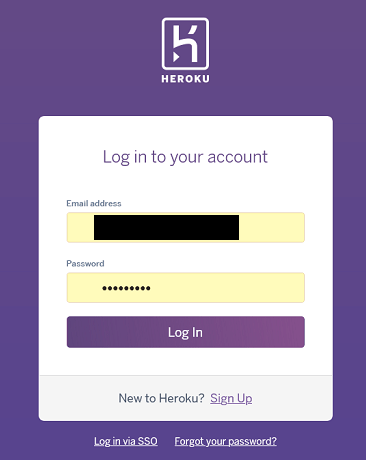

<h1 align=center> </h1>

Live app link [here]()

## User Experience

### User Stories

1. As a user, I would like to be able to …

    1.1 Register on the website using my username, email and password;
    
    1.2. 
    
    1.3 
    
    1.4   

2. As a logged user, I would like to be able to …

    2.1 

    2.2 

    2.3 

    2.4 

### 1. Strategy

  + **Project Goal**

### 2. Scope

 * A simple, straightforward, intuitive UX experience;
 * An explicit content; 
 * An easy navigation for the user through all the features;
 * A site that is visually appealing on most devices.

## Functional Scope 

**Flowchart**

**DER - Diagram Entity Relationship**

**Agile Methodology**

All functionality and development of this project were managed using [Jira](https://bestbeer.atlassian.net)

* Credentials to this management tool will be provided during submission.

All sprints are described here.

Test cases were linked with every User story presented above, and can be found in [TESTING.md](TESTING.md)- Automated testing section. 

* Sprint 1 - 04/01/2022 - 11/01/2022 (Finished at 09/01/2022)

  + Initial setup
    - As a developer, I want to setup django templates
  + Create Database and Deployment on Heroku
    - As a developer, I want to set up a Database to store all data 
    - As a developer, I want to deploy website on Heroku
  + Create user registration and login/logout features
    - As a user I want to register on website
    - As a user I want to login on website
    - As a user I want to logout on website
    - As a site admin I want to have admin privileges 

* Sprint 2 - 09/11/2022 - 16/01/2022

  + Create products page
    - As a shopper I want to to see details about each available box
    - As a shopper I want to add product on my bag 
    - As a shopper I want to check all available products 
    - As a shopper I want to sort a list of products by region (Not done on this sprint. Will be add in future sprints)

* Sprint 3

  + 

* Sprint 4

  + 

* Sprint 5

  + 

* Sprint 6

  + 

* Sprint 7

  + 

### 3. Structure

* A clear and straightforward layout is in place to ensure users can navigate intuitively and have a leisurely experience.
* Navbar is fixed on top to facilitate users to navigate through pages easily. Small navigation is the same on all pages to ensure easy navigation.
* 

### 4. Skeleton

Wireframes created with Balsamiq. The project was developed from initial wireframes, and some modifications were made during the development process in respose to user feedbacks and to assure the best usability. 

Click to see wireframes:

[HomePage](media/readme/wireframes/homepage.png)  
[Register Page](media/readme/wireframes/register_page.png)  
[Login Page](media/readme/wireframes/login.png)  
[Reginal items Page](media/readme/wireframes/region_items_available.png)  
[Bag Page](media/readme/wireframes/bag.png)  
[Payment Page](media/readme/wireframes/payment_page.png)  
[Order Placed Page](media/readme/wireframes/order_placed_page.png)  
[Site Map Page](media/readme/wireframes/site_map.png)  

### 5. Surface

* Colours

The Colour scheme was generated using the eyedropper plugin to get one colour from the logo image and [colours](https://coolors.co/) to create the colour palette.

* Font Selection
 
Two complimentary fonts were chosen with [Google Fonts](https://fonts.google.com/) to be used across the website.

The chosen fonts were Roboto for headings and navbar and Lato for links, buttons and paragraphs.

## Existing Features

### **Navbar** 

+ Fixed Navbar allow the user easy access to all pages. 

1. Login and  Register User buttons are present on the navbar if the user is not logged. 

2. Logout is present if the user is logged. 

3. 

4.  

5. Collapsed navbar on smaller devices to wrap in all options and assure better navbar design.

  

## Future Features

I would like to ...

1. 

## Languages Used

Python 3.0

## Frameworks, Libraries & Programs Used

+ Balsamiq: Balsamiq was used to create the wireframes during the design process.
+ Favicon Generator: Used to create favicon used on the website.
+ Font Awesome: Font Awesome was used on all pages to add icons for aesthetic and UX purposes.
+ Grammarly: Used to correct any spell mistakes on readme and app text.
+ Git: Git was used for version control by utilizing the Gitpod terminal to commit to Git and Push to GitHub.
+ GitHub: GitHub is used to store the project's code after being pushed from Git.
+ Google Fonts: Google fonts are used to add fonts for aesthetic and UX purposes.
+ Django: Framework used to add structure to the platform. 
+ PGAdmin: Used to administer Database and generate DER.
+ Multi Device Website Mockup Generator: Used to generate mockup image.

## Testing and Code validation 

All testing and code validation details are described in a separate file called TESTING.md and can be found [here](TESTING.md).

## Project Bugs and Solutions:

| Bugs              | Solutions |
| ---               | --------- |
|                   |           |

## Deployment 

This App is deployed using Heroku.

Heroku Deployment steps 

 
 1. Ensure all dependencies are listed on requirements.txt. 
 
 Write on python terminal ` pip3 freeze > requirements.txt`, and a list with all requirements will be created to be read by Heroku. 
 
 2. Setting up your Heroku

    2.1 Go to Heroku website (https://www.heroku.com/). 
    2.2 Login to Heroku and go to Create App.
    
    
    
    
    
    2.3 Click in New and Create a new app
    
    
    
    2.4 Choose a name and set your location
    
    

    2.5. Navigate to the Resources tab 

    

    2.6. Click on Resources and Seach for Heroku Postgres and select it on the list.
    
    
    
    2.7. Navigate to the deploy tab
    
    
    
    2.8. Click in Connect to Github and search for 'nandabritto' GitHub account and 'search_your_brand' repository
    
    
    
    2.9.  Navigate to the settings tab
    
    
    
    2.10.  Click on Config Vars, and add your Cloudinary, Database URL (from Heroku-Postgres) and Secret key.    
    
    
 

3. Deployment on Heroku

    3.1.  Navigate to the Deploy tab.
    
    
    
    3.2.  Choose the main branch to deploy and enable automatic deployment to build Heroku every time any changes are pushed on the repository.
    
    
    
    3.3 Click on manual deploy to build the App.  When complete, click on View to redirect to the live site. 
    
    

Forking the GitHub Repository 

* By forking the GitHub Repository, you will be able to make a copy of the original repository on your own GitHub account, allowing you to view and/or make changes without affecting the original repository by using the following steps:

    Log in to GitHub and locate the GitHub Repository
    At the top of the Repository (not top of page), just above the "Settings" button on the menu, locate the "Fork" button.
    You should now have a copy of the original repository in your GitHub account.

* Making a Local Clone

    Log in to GitHub and locate the GitHub Repository
    Under the repository name, click "Clone or download".
    To clone the repository using HTTPS, under "Clone with HTTPS", copy the link.
    Open Git Bash
    Change the current working directory to the location where you want the cloned directory to be made.
    Type git clone, and then paste the URL you copied in Step 3.

$ git clone https://github.com/nandabritto/PP5

Press Enter. Your local clone will be created.

# Credits

## Media

+ All pictures and images used in this project are from [Depositphotos](https://depositphotos.com).

## Work based on other code

[**JustDjango Youtube Channel**](https://www.youtube.com/channel/UCRM1gWNTDx0SHIqUJygD-kQ) - Used as a base to develop cart and checkout features 
[**Dennis Ivy Youtube Channel**](https://www.youtube.com/channel/UCTZRcDjjkVajGL6wd76UnGg)- Used as a base to develop cart, checkout and confirmation email features 
[**Master Code Online**](https://www.youtube.com/channel/UCbhm6TbMBTWn_GxrIbPFapA)- Used as a base to develop newsletter app  
[**Code With Stein**](https://www.youtube.com/channel/UCfVoYvY8BfTDeF63JQmQJvg)- Used as a base to develop box reviews app  
 
# Acknowledgements

+ Stack Overflow is a valuable resource for solving lots of issues.
+ W3schools and Django documentation for general reference.

I would also like to thank:

+ My husband Guilherme for all the support on stressful moments, helping to figure out lots of bugs and for reviewing everything.
+ Code institute tutors and my CI Mentor Daisy Mcgirr for the guidance and help with several issues and bugs.