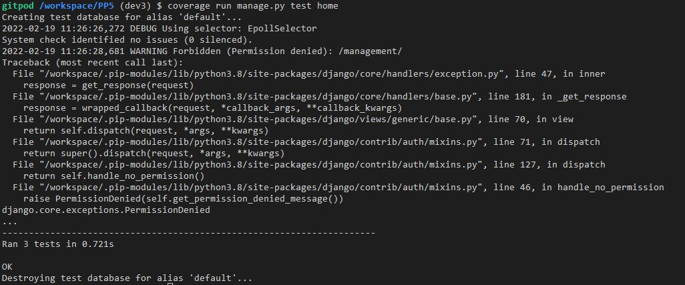
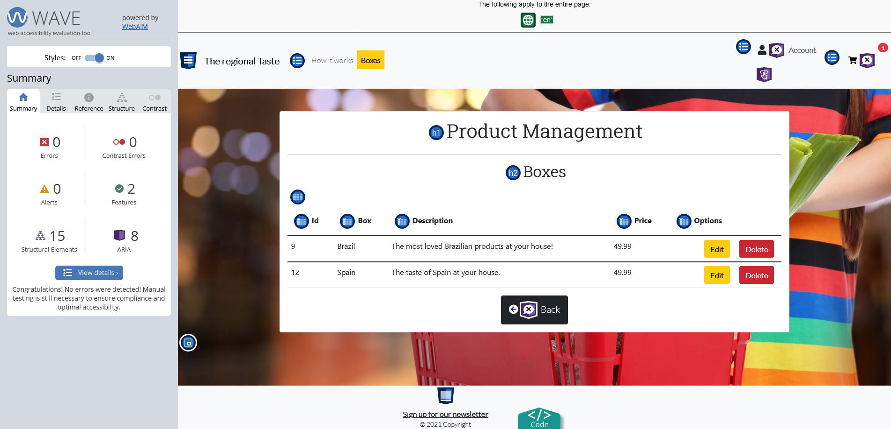
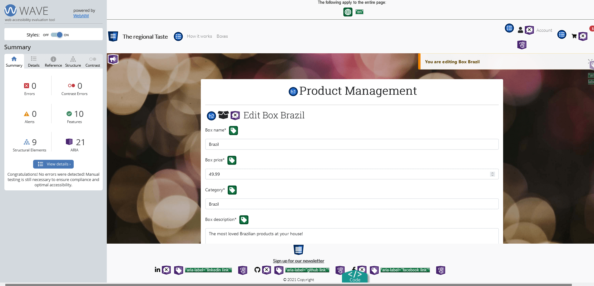

# Testing

During the code development of each function, tests were in place to be sure that it was running as expected. The following sections describe all tests and error handling in place.

## Testing Plan

Testing will be conducted regularly alongside the development of this project. Therefore, each User Story will include Unit testing of the developed code and a manual exploratory test session.

### Sprint 1 - 04/01/2022 - 11/01/2022 (Finished at 09/01/2022)

Unittest was done to ensure all home app functionality was working as expected. 

### Sprint 2 - 09/01/2022 - 16/01/2022

Unittest was done to ensure all products, cart, and order functionality developed until this point was working as expected.

+ Functions tested: 

| App | File | Class/Function Name |
|:---:|:---:|:---:|
| Product | Views | boxes |
| Product | Views | box_details |
| Product | Models | Product |
| Product | Models | Box |
| Product | Models | s |
| Cart | Models | cart |
| Cart | Models | updateCart |

+ Products View

+ Products Models Initial

+ Products Models Final

+ Products Final All

+ Cart Views

+ Cart App Unitests All

+ Sprint 2 Unittest Coverage

### Sprint 3 - 17/01/2022 - 24/01/2022

Order and payment functionality begin to be developed during this sprint. Still, all unit tests will be created at sprint 4 when these features are complete and working as expected. 
  
### Sprint 4 - 25/01/2022 - 31/01/2022

Order and payment functionality was finished on this sprint, and we developed unittests to ensure every feature was working as expected without significant issues. 

+ Functions tested: 

| App | File | Class/Function Name |
|:---:|:---:|:---:|
| Order | Models | Order |
| Order | Models | OrderBox |
| Order | Models | Address |
| Order | Models | Payment |
| Order | Views | is_valid_form() |
| Cart | Views | CheckoutView |
| Cart | Views | PaymentView |
| Cart | Views | success |

+ Order Models

+ Order Views - Part 1

+ Sprint 4 Unittest Coverage - Part 1 (partial)

+ Order Views - Part 2

+ Order App Unittests All

+ Sprint 4 Unittest Coverage - Final

**Note:** The lines highlighted in red were not covered in unittests related to Stripe exceptions and were tested manually after this sprint. 

  
### Sprint 5 - 30/01/2022 - 06/02/2022

A user profile was created on this sprint, and manual tests were conducted to ensure all functionality was working as expected.  

| Test Case Id | Description | Expect result|
|:----:|:----:|:----:|
| 1 | Click on profile option on accounts dropdown menu| To be redirected to profiles page|
| 2 | Click in Add default shipping or billing address | To be redirected to change address page |
| 3 | Change shipping or billing address and confirm on button | Save default addresses |

### Sprint 6 - 07/02/2022 - 14/02/2022

Create a feature to add selectable products on the box and a product management page to an admin user that can have all CRUD functionality from the frontend.
Manual tests were conducted to ensure all features were working as expected. 

+ Box details page 
| Test Case Id | Description | Expect result|
|:----:|:----:|:----:|
| 1 | Go to the box details page and find checkbox selectable products list | Can choose maximum on five different products|
| 2 | After selecting products, click on add to cart button | The box option with the list of the selected products will be added to the cart |
| 3 | Try to click on six products | only allows clicking in 5 products. |

+ Product Management page

| Test Case Id | Description | Expect result|
|:----:|:----:|:----:|
| 1 | click on add products/boxes/products on box button | To be redirected to the respective page with all fields|
| 2 | After adding all information, click on add product/box/ product on box | To be redirected to products/box list |
| 3 | on products/boxes list page and click in delete button| Delete product/box and be redirected to list page |

### Sprint 7 - 13/02/2022 - 22/02/2022

Unittests were developed for remaining functions on Newsletter, Home, Cart*, Product_review**, Order*** and all functions on Products App Views.

*Cart - Update unittest with product_selectable variable

*Product_review - Done unitest string function

***Order - Add shipping unittest

+ Functions tested: 

| App | File | Class/Function Name |
|:---:|:---:|:---:|
| Newsletter | Models | NesletterUser |
| Newsletter | Models | Nesletter |
| Newsletter | Views | newsletter_signup |
| Newsletter | Views | newsletter_unsubscribe |
| Newsletter | Views | send_newsletter |
| Home | Views | index |
| Home | Views | StaffRequiredMixin |
| Cart | Views | update_cart |
| Product_review | Models | BoxReview |
| User_profile | Models | UserProfile |
| User_profile | Views | get_customer_address |
| User_profile | Views | profile |
| User_profile | Views | update_profile |
| Order | Models | shipping |
| Order | Views | TestGetCheckoutSummaryView |
| Order | Views | TestOrderDetailView |
| Products | Views | BoxDetailTestCase |
| Products | Views | ProductDetailTestCase |
| Products | Views | TestViews |
| Products | Views | AddBoxTestCase |
| Products | Views | AddProductTestCase |
| Products | Views | AddProductOnBoxTestCase |
| Products | Views | EditProductTestCase |
| Products | Views | EditReviewTestCase |
| Products | Views | DeleteReviewTestCase |
| Products | Views | DeleteBoxTestCase |
| Products | Views | DeleteProductOnBoxTestCase |
| Products | Views | DeleteProductTestCase|
| Products | Views | DeleteBoxTestCase|

+ Newsletter Models

+ Newsletter Views

+ Home Views

+ Cart Views

+ Product_review Models

+ User Profile Models

+ User Profile Views

+ Order Models

+ Order Views

+ Products Views

+ Unittests All

+ Sprint 4 Unittest Coverage - Final

**Note:** The lines highlighted in red were not covered in unittests related to edition exceptions on the management page and were tested manually during this sprint. 

## Integration Test Case

+ On this project, the Incremental Testing method was used.

 Integrated units were checked after the developer finished writing code for every new feature. This approach was used to find defects early because it was easy to find the cause of the defect thanks to a step-by-step examination. 

+ The integration tests were divided by features/pages and its described below: 

### **Navbar**

| Test Case Id | Description | Expect result|
|:----:|:----:|:----:|
| 1 | Click account's navbar button | Open a dropdown with three options if logged and supper user and two options with not superuser or not logged|
| 2 | A registered user click login's button | To be redirected to login page |
| 3 | A registered user click logout's button | To be redirected to logout page |
| 4 | A not registered user click register's button | To be redirected to registration page |
| 5 | A user click on Cart Button | To be redirected to the cart page |
| 6 | Click products navbar button | Open a dropdown with all products options|

### **Footer** 

| Test Case Id | Description | Expect result|
|:----:|:----:|:----:|
| 1 | Click subscribe newsletter button| To be redirected to subscribe to the store newsletter. |
| 2 | Click on the LinkedIn button| To be directed to the developer's LinkedIn page. |
| 3 | Click on the Github button | To be redirected to the developer's GitHub page.|
| 4 | Click on the Facebook button | To be directed to the store Facebook page.|

### **Login**

| Test Case Id | Description | Expect result|
|:----:|:----:|:----:|
| 1 | Enter login credentials and click on the Login button| To be directed to the home page|
| 2 | Enter invalid login credentials and click on the Login button| To be presented to an error message for each weak field|

### **Logout**

| Test Case Id | Description | Expect result|
|:----:|:----:|:----:|
| 1 | A registered user click logout's button | To be redirected to logout page |
| 2 | Click on Logout Button| To be redirected to the home page and a message about logout session|

### **Register**

| Test Case Id | Description | Expect result|
|:----:|:----:|:----:|
| 1 | Enter all registered data and click on the Sign-Up button| To be directed to the home page, presented to a success message and already logged in|
| 2 | Enter invalid register data in any field and click on the Login button| To be given to an error message|

### **Boxes Page**

| Test Case Id | Description | Expect result|
|:----:|:----:|:----:|
| 1 | A user on boxes page | To be presented to all available boxes with image, description, price and two option buttons|
| 2 | Click on Add to cart button| Add chosen product to user's cart|
| 3 | Click on Details button| To be redirected to product details page|

### **Box Detail Page**

| Test Case Id | Description | Expect result|
|:----:|:----:|:----:|
| 1 | A user on box detail page | To be presented to all box details|
| 2 | Choose 5 product options to add to user's box | Add chosen products to user's box|
| 3 | Click on Add to cart button| Add desired boxes with selectable products chosen to user's cart|
| 4 | Click on Back button| To be redirected to the last visited page|

### **Profile Page**

| Test Case Id | Description | Expect result|
|:----:|:----:|:----:|
| 1 | A user on profile page | To be presented to all previous orders and details.|
| 2 | Click in one of the numbers of prior order | Be redirected to order detail page with all information about it|
| 3 | Click on Add to cart button| Add chosen boxes with selectable products chosen to user's cart|
| 4 | Click on Back button| To be redirected to the last visited page|
| 5 | Click in Add default shipping or billing address | To be redirected to change address page |
| 6 | Change shipping or billing address and confirm on button | Save default addresses |

### **Management Page** 

| Test Case Id | Description | Expect result|
|:----:|:----:|:----:|
| 1 | click on add products/boxes/products on box button | To be redirected to the respective page with all fields|
| 2 | After adding all information, click on add product/box/ product on box | To be redirected to products/box list |
| 3 | on products/boxes list page and click in delete button| Delete product/box and be redirected to list page |

## Python (PEP8) Validation

### Home App

   
   
      

### Cart App

   
   
   
   
          

### Newsletter App

   
   
   
   
   
    
   
    

### Product Review App

   
   
   
   
   
    

### Product App

   
   
   
   
   
   
   
    

### User Profile App

   
   
   
   
   
   
   

### Store App

   
   
   
   
   
   

 The error found on settings are related to 4 links:

## HTML Code Validation

All Html pages were validated using the W3 tool. 

### Home app

Expand for test results:

[Home](media/readme/validation/html/home.png)

[How it works](media/readme/validation/html/how_it_works.png)

[Management](media/readme/validation/html/management.png)

### Cart app

Expand for test results:

[Cart](media/readme/validation/html/cart.png)

### Newsletter app

Expand for test results:

[Newsletter List](media/readme/validation/html/newsletterlist.png)

[Send Newsletter](media/readme/validation/html/sendnewsletter.png)

### Order app

Expand for test results:

[Checkout](media/readme/validation/html/order_checkout.png)

[Checkout Summary](media/readme/validation/html/order_checkout_summary.png)

[Payment](media/readme/validation/html/order_payment.png)

[Order details](media/readme/validation/html/order_order_detail.png)

### Product Review app

Expand for test results:

[Edit review](media/readme/validation/html/product_review_edit_review.png)

### Product app

Expand for test results:

[Add Box](media/readme/validation/html/products_add_box.png)

[Add Product on Box](media/readme/validation/html/products_add_product_on_box.png)

[Add Product](media/readme/validation/html/products_add_product.png)

[Box detail](media/readme/validation/html/products_box_detail.png)

[Box detail](media/readme/validation/html/products_box_detail.png)

[Box list](media/readme/validation/html/products_boxes_list.png)

[Edit Boxes](media/readme/validation/html/products_edit_boxes.png)

[Edit Products](media/readme/validation/html/products_edit_products.png)

[Products details](media/readme/validation/html/products_product_detail.png)

[Products List](media/readme/validation/html/products_products_list.png)

[Products](media/readme/validation/html/products_products.png)

[Products on Box List](media/readme/validation/html/products_productsonbox_list.png)

### All auth templates

Expand for test results:

[Login](media/readme/validation/html/login_page.png)

[Logout](media/readme/validation/html/products_add_product_on_box.png)

[Account Inactive](media/readme/validation/html/account_inative.png)

[Password reset Done](media/readme/validation/html/password_reset_done_page.png)

[Password reset](media/readme/validation/html/password_reset_page.png)

[Confirm email](media/readme/validation/html/confirm_email.png)

[Change Password](media/readme/validation/html/changepassword.png)

[Chaged Password](media/readme/validation/html/changed_password_page.png)

[Register](media/readme/validation/html/register_page.png)

[Set Password](media/readme/validation/html/set_password_page.png)

### User Profile app

Expand for test results:

[Profiles](media/readme/validation/html/user_profile_profiles.png)

[Update Profile](media/readme/validation/html/user_profile_update_profile.png)

## JavaScript Code Validation

### Cart_js

   

### Checkout_js

   

### Countryfield_js

   

### Stripe_elements_js

   

## Css Validation

### Base.css

No errors were found on base css. The warnings found are related to border and background colour. 

   

   

## Accessibility Testing

 
All pages were tested using the Wave accessibility tool, and the results can be checked here:

  + Home 

  

   + Register

  

  + Login

  

  + Logout

  

  + How it works

  

  + Boxes

  

  + Boxes Details

  

  + Cart

  

  + Checkout

  

  + Checkout Summary

  

  + Payment

  

  + Product Management

  

  + Products List

  

   + Products on box List

  

  + Boxes List

  

  + Add box 

  

  + Add product

  

  + Add Product on Box

  

  + Edit box 

  

  + Edit product

  

  + Edit Product on Box

  

  + Send newsletter 

  

  + Newsletter List

  

  + Profile

  

  + Update Profile

  
   
   
 Accessibility errors on ths page are related a design choice of no labels on form. Instead, its possible to find placeholders. 

   
   

 

## Exploratory Testing

### Initial User Testing (Alpha)

A session was held with an end-user. The feedback obtained is listed below:

1. How it works page 
   1.1 Includes  info about the need to be a logged user to add items in the cart 

2.  Box details page

   2.1 Redirect login page - Add a hyperlink to the user don't need to wait 2 seconds;
   2.2 Add review took me some clicks to open. After refresh modal opened ;
   2.3 Info pop up when user select more than five items; 
   2.4 Customizable products are not capitalized. 
      
3. Login page
   
   3.1 Use a bold or different colour on the signup link;
   3.2 Income e-mail subject - "[example.com] Please Confirm Your E-mail Address".

4. Checkout page

   4.1 Change some labels to names more suitable;
   4.2 When I use checkboxes to "Save default shipping address", "Billing address is the same as my shipping address", "Set default billing address" the addresses fields are not omitted.
   
5. Checkout Summary page

   5.1 Reduce spacing between address fields to make them seems like address tag ;
   5.2 Delivery to PT(international) was 10 euro.

6. Payment page
   
   6.1 Format seems wrong. Not much information/visual aid to fill details. Seem some figure is missing;
   6.2 After payment: "Your order was successful" Messages keep long and overlays, blocking the Account menu.     

7. Order page

   7.1 I can't see addresses chosen to deliver or see any delivery estimates.

8. Profiles page

   8.1 There are two "Add your Default Shipping Address" (no billing);
   8.2 Even after setting Default Address, I can't find them listed on the profile page or Update Profile page.
   
9. Subscribe page

   8.1 After I subscribe, I should be redirected to another page; otherwise, it seems it failed.
   
### **Response to the user experience test:**

+ The majority of user feedback and bugs found was incorporated and fixed on the platform except by points: 

| Items numbers | Situation | Response|
|:----:|:----:|:----:|
|  2.1 | WNF  | By design |
| 2.2 | CNR -NAB | Error couldn't be reproduced in several computers, and probably its NAB|
| 6.1| CNR-NAB | Error couldn't be reproduced in several computers, and probably its NAB|

+ CNR - Cannot Reproduce
+ NAB - Not a Bug
+ WNF - Will not fix

### Final User Testing (Beta)

On this test, a checklist was developed to guide the user along with all pages and features on the platform. This checklist and the results can be viewed here: 

[Features]()  
[Pages]()

### **Response to the user experience test:**

## Manual Testing

### Desktop

The platform was tested on Mozilla Firefox Developers and Google Chrome, and everything was working as expected.

### Mobile

  Tested with Xiaomi Mi6, Xiaomi Mi8 and Samsung Gallaxy S21, and all features were working as expected. 
